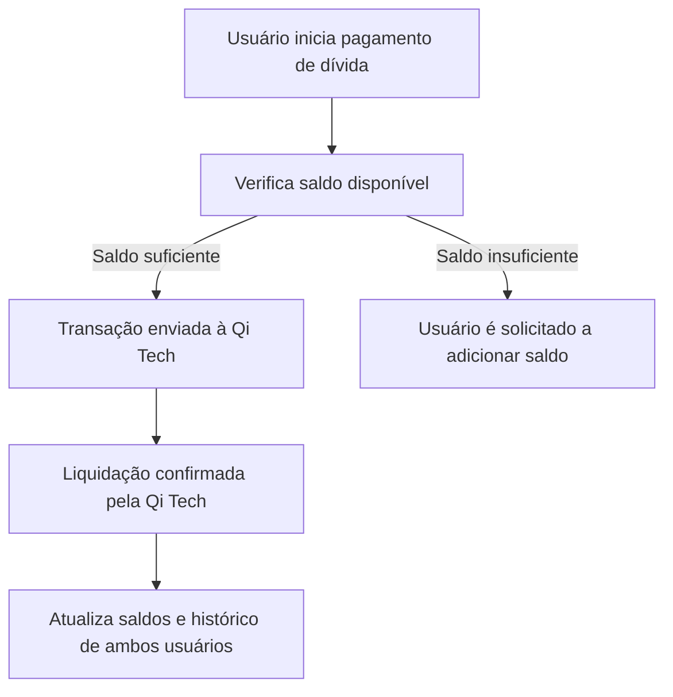
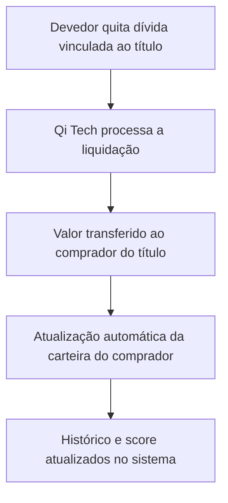
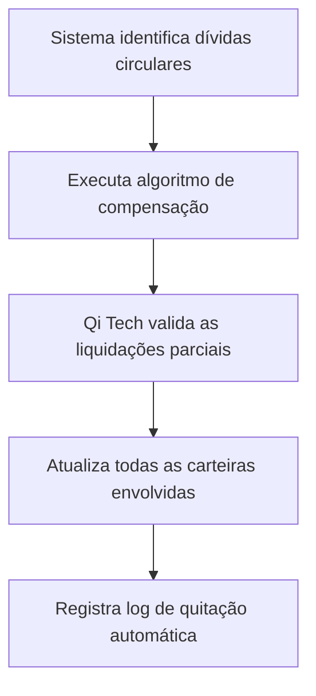

# Carteira Digital

## Visão Geral

A **Carteira Digital** é o módulo financeiro central do *The Simple Split*.  
Ela permite o gerenciamento de todas as transações realizadas dentro do aplicativo, incluindo inserção de saldo, pagamentos, recebimentos e transferências.  
Sua função principal é assegurar que todas as movimentações financeiras ocorram de forma transparente, segura e rastreável, utilizando a infraestrutura da Qi Tech para liquidação e custódia dos valores.

### Funcionalidades da Carteira

- Depósito e saque de valores em reais.  
- Pagamento e recebimento de dívidas entre usuários.  
- Compra e venda de títulos de recebíveis no marketplace.  
- Consulta de histórico completo de movimentações.  
- Atualização automática do saldo após cada operação.  

### Integração com Sistema de Dívidas

A carteira está diretamente integrada ao **Sistema de Dívidas**.  
Quando uma dívida é registrada, o valor correspondente é vinculado à carteira de cada usuário envolvido.  
A quitação de dívidas, compensações automáticas (logs) e recebimentos de títulos são processados utilizando os saldos mantidos neste módulo.

---

## Operações

### Inserção de Saldo

O usuário pode inserir saldo na carteira por meio de transferência bancária (Pix ou TED), utilizando a infraestrutura BaaS da Qi Tech.  
Os valores ficam disponíveis imediatamente após a confirmação da transação.

### Pagamentos

Os pagamentos ocorrem dentro do ambiente do aplicativo, garantindo rastreabilidade total.  
O usuário pode pagar dívidas diretas, adquirir títulos no marketplace ou transferir saldo para outro participante.

### Recebimentos

Ao receber valores de uma dívida quitada ou de um título vendido, a carteira é automaticamente creditada.  
A liquidação é feita pela Qi Tech, assegurando a integridade e autenticidade da transação.

### Transferências

A funcionalidade de transferência permite que usuários movam valores entre carteiras dentro da plataforma.  
Essa operação também utiliza o sistema de liquidação da Qi Tech e mantém registros detalhados para auditoria.

---

## Integração com QI Tech

A Carteira Digital opera sobre a infraestrutura da Qi Tech, utilizando suas APIs de **Banking as a Service (BaaS)**, **pagamentos** e **custódia**.  
Isso garante conformidade regulatória e segurança nas operações financeiras.

### BaaS (Banking as a Service)

A Qi Tech fornece contas de pagamento individuais para cada usuário do aplicativo.  
Essas contas são usadas para armazenar e movimentar os valores vinculados à carteira.

### Processamento de Transações

Cada transação — pagamento, recebimento ou transferência — é registrada e processada pela Qi Tech em tempo real, com confirmação automática no aplicativo.  
Essa integração elimina a necessidade de sistemas de compensação externos.

### Segurança das Operações

A segurança é garantida por múltiplos níveis de autenticação (2FA), verificação de identidade via KYC e comunicação criptografada ponta a ponta.  
Todas as movimentações são auditáveis e registradas no histórico do usuário.

---

## Gestão Financeira

### A Receber (Dívidas + Títulos Comprados)

A seção **A Receber** exibe:
- Dívidas a favor do usuário, registradas em grupos.  
- Títulos de recebíveis adquiridos no marketplace.  

Cada item apresenta:
- Valor nominal.  
- Data prevista de pagamento.  
- Status de liquidação.

### A Pagar

Lista todas as obrigações financeiras pendentes do usuário, sejam dívidas registradas ou títulos adquiridos que ainda não foram liquidados.  
A quitação pode ser feita manualmente ou automaticamente, conforme os logs de compensação do sistema.

### Histórico de Movimentações

Apresenta todas as transações realizadas, com filtros por tipo de operação (pagamento, recebimento, transferência).  
Cada registro contém o valor, a data, a contraparte e o status.

---

## Fluxos de Pagamento

### Pagamento de Dívida via Carteira

Figura 1 - Fluxo de Pagamento de Dívida via Carteira

Fonte: Os autores (2025)

### Recebimento de Título do Marketplace

Figura 2 - Fluxo de Recebimento de Título do Marketplace

Fonte: Os autores (2025)

### Quitação Automática

Figura 3 - Fluxo de Quitação Automática via Logs

Fonte: Os autores (2025)
 

