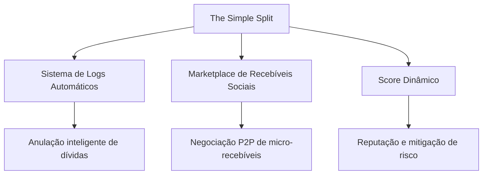
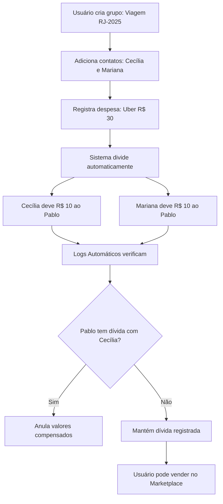
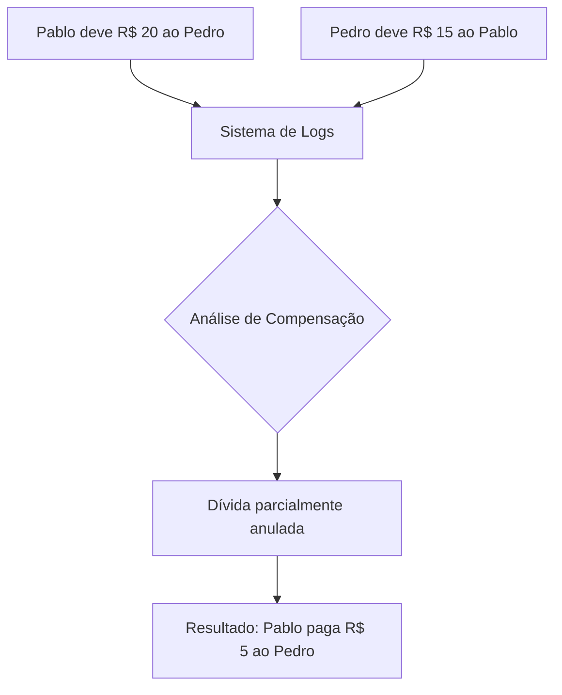

# The Simple Split — Gestão Inteligente de Dívidas Sociais

<iframe width="700" height="340" src="https://www.youtube.com/embed/SEU_VIDEO_AQUI" title="The Simple Split - Pitch Video" frameborder="0" allow="accelerometer; autoplay; clipboard-write; encrypted-media; gyroscope; picture-in-picture; web-share" referrerpolicy="strict-origin-when-cross-origin" allowfullscreen></iframe>

Vídeo de apresentação do projeto The Simple Split para o Inovacamp QI Tech 2025.

#### **Pitch PDF:** [Clique aqui para acessar o Pitch completo](https://drive.google.com/seu-link-aqui)

---

## Introdução

Todos os anos, milhões de brasileiros emprestam dinheiro a amigos e familiares, dividem despesas em viagens ou eventos, mas enfrentam dificuldades para receber de volta. A fricção social e a falta de confiança resultante desse cenário representa a dor central que o The Simple Split resolve.

Segundo o Serasa, 61% dos brasileiros já se arrependeram de emprestar dinheiro para conhecidos. O famoso "deixa pra lá" se transforma em desconforto, constrangimento e, frequentemente, em relacionamentos comprometidos.

The Simple Split surge como sistema de gestão de dívidas coletivas com marketplace de micro-recebíveis peer-to-peer, criando uma nova categoria B2C para a QI Tech que democratiza o acesso à negociação de títulos de valores pequenos entre pessoas físicas.

---

## O Problema

### A Fricção das Dívidas Sociais

import Tabs from '@theme/Tabs';
import TabItem from '@theme/TabItem';

<Tabs>
  <TabItem value="cenario" label="Cenário Comum" default>
    Você e seus amigos viajam juntos. Cada um paga uma despesa diferente: Uber, restaurante, hospedagem. No final da viagem, ninguém tem clareza sobre quem deve o quê para quem. As contas ficam pendentes indefinidamente.
  </TabItem>
  <TabItem value="consequencias" label="Consequências">
    <ul>
      <li>Dívidas não quitadas por vergonha ou esquecimento</li>
      <li>Perda financeira em transações pequenas que "não compensam" cobrar</li>
      <li>Constrangimento social ao cobrar amigos e familiares</li>
      <li>Confiança quebrada quando alguém não honra compromissos</li>
    </ul>
  </TabItem>
  <TabItem value="numeros" label="Os Números">
    <ul>
      <li>R$ 61 bilhões em empréstimos informais não pagos no Brasil (estimativa)</li>
      <li>61% dos brasileiros já se arrependeram de emprestar dinheiro (Serasa)</li>
      <li>Média de R$ 300-500 por pessoa em dívidas sociais não quitadas</li>
      <li>Zero ferramentas para negociar micro-recebíveis entre pessoas físicas</li>
    </ul>
  </TabItem>
</Tabs>

### Limitações das Soluções Existentes

<p style={{textAlign: 'center'}}>Tabela 1 - Análise Comparativa de Soluções Existentes</p>

| Solução | Funcionalidade | Limitação Principal |
|---------|----------------|---------------------|
| Splitwise, Tricount | Divisão e registro de despesas | Sem carteira, sem facilitação de pagamento, sem marketplace |
| Plataformas P2P tradicionais | Empréstimos entre pessoas | Valores altos (R$ 5k+), burocracia, taxas elevadas |
| Bancos digitais | Transferências e pagamentos | Sem gestão de dívidas coletivas ou negociação de recebíveis |

<p style={{textAlign: 'center'}}>Fonte: Os autores (2025)</p>

:::warning[Gap de Mercado]
Existe um vazio entre aplicativos de divisão de contas (que apenas registram) e plataformas de empréstimo P2P (que focam em valores altos). The Simple Split preenche esse gap com gestão completa de micro-dívidas sociais.
:::

---

## A Solução

### Arquitetura da Proposta

The Simple Split opera sobre três pilares tecnológicos integrados:

<p style={{textAlign: 'center'}}>Figura 1 - Pilares do The Simple Split</p>



<p style={{textAlign: 'center'}}>Fonte: Os autores (2025)</p>

### Fluxo de Funcionamento

<p style={{textAlign: 'center'}}>Figura 2 - Fluxo de Operação do Sistema</p>



<p style={{textAlign: 'center'}}>Fonte: Os autores (2025)</p>

### Stack Tecnológico

:::info[Arquitetura Técnica]
- **Frontend:** Flutter (interface minimalista, multiplataforma)
- **Backend:** Python (integração com APIs QI Tech)
- **Banco de Dados:** SQLite (armazenamento local eficiente)
- **Infraestrutura:** QI Tech (KYC, BaaS, custódia de recebíveis)
:::

### Exemplo Prático: Marketplace

```
Situação: Cecília tem R$ 40 para receber de um devedor em 30 dias.
Necessidade: Precisa do dinheiro hoje para uma emergência.

Ação no The Simple Split:
1. Cecília lista o recebível no marketplace por R$ 35
2. Comprador vê: "Usuário Anônimo (Score: 8.5) | Valor: R$ 40 | Venda: R$ 35"
3. Comprador adquire o título por R$ 35
4. Cecília recebe R$ 35 imediatamente
5. Quando devedor pagar, comprador recebe R$ 40 (lucro de R$ 5)
6. QI Tech formaliza e custodia toda a operação
```

---

## Diferenciais e Inovação

### Sistema de Logs Automáticos

**Problema Tradicional:** Você deve R$ 20 ao Pedro, mas o Pedro te deve R$ 15. O resultado são duas transferências desnecessárias (você paga R$ 20, ele paga R$ 15).

**Solução The Simple Split:** O sistema identifica essas compensações e anula automaticamente os valores, informando que você precisa apenas pagar R$ 5 ao Pedro.

<p style={{textAlign: 'center'}}>Figura 3 - Funcionamento dos Logs Automáticos</p>



<p style={{textAlign: 'center'}}>Fonte: Os autores (2025)</p>

**Casos Cobertos:**
- Compensação entre duas pessoas
- Compensação entre múltiplos grupos
- Compensação circular (A→B→C→A resulta em todas as dívidas quitadas)

### Marketplace de Recebíveis Sociais

**Problema Tradicional:** Você tem R$ 100 para receber em 30 dias, mas precisa do dinheiro hoje. Não existe mercado para negociar esse recebível de valor pequeno.

**Solução The Simple Split:** Marketplace peer-to-peer onde você vende seu recebível por R$ 90. O comprador assume o direito e recebe os R$ 100 quando o devedor pagar.

:::tip[Viabilidade Técnica]
A negociação de micro-recebíveis (R$ 10-500) se torna economicamente viável através da infraestrutura da QI Tech:
- Formalização pela licença SCD
- Custódia segura dos títulos
- Custos operacionais baixos
- Score dinâmico mitiga risco de crédito
:::

**Características do Marketplace:**
- Anonimato total (exibe apenas "Usuário X" + score)
- Decisão baseada em reputação (score 0-10)
- Formalização e custódia pela QI Tech
- Limites: R$ 10 a R$ 500 (foco em micro-recebíveis)

### Score Dinâmico

Sistema de reputação que resolve o problema de confiança no marketplace.

<p style={{textAlign: 'center'}}>Tabela 2 - Fatores de Impacto no Score</p>

| Ação | Impacto no Score | Justificativa |
|------|------------------|---------------|
| Pagamento em dia | +0.2 a +0.5 | Recompensa comportamento positivo |
| Atraso de 1-7 dias | -0.1 | Penalidade leve |
| Atraso de 8-30 dias | -0.3 | Penalidade moderada |
| Inadimplência (30+ dias) | -1.0 a -2.0 | Penalidade severa |
| Histórico limpo (6 meses) | +0.5 | Incentivo à consistência |

<p style={{textAlign: 'center'}}>Fonte: Os autores (2025)</p>

**Uso Prático:** No marketplace, o comprador visualiza "Usuário Anônimo (Score: 8.5)" e toma decisão informada sobre assumir o risco do recebível.

### Análise Comparativa

<p style={{textAlign: 'center'}}>Tabela 3 - The Simple Split vs. Soluções Existentes</p>

| Funcionalidade | The Simple Split | Apps Tradicionais | Empréstimo P2P |
|----------------|------------------|-------------------|----------------|
| Gestão de dívidas coletivas | Sim | Sim | Não |
| Logs automáticos | Sim | Não | Não |
| Marketplace de recebíveis | Sim | Não | Não |
| Carteira integrada | Sim | Não | Sim |
| Score dinâmico | Sim | Não | Sim (tradicional) |
| Micro-valores (R$ 10+) | Sim | Sim | Não (mín. R$ 5k) |
| Pagamento facilitado | Sim | Não | Sim |

<p style={{textAlign: 'center'}}>Fonte: Os autores (2025)</p>

### Novo Nicho para a QI Tech

**Expansão B2C:** A QI Tech opera majoritariamente B2B. The Simple Split abre um novo mercado direcionado a milhões de usuários finais (B2C).

**Democratização de Recebíveis:** Pela primeira vez, pessoas físicas podem negociar recebíveis de baixo valor, operação inviável sem a infraestrutura da QI Tech (licença SCD, custódia, KYC automatizado).

**Escalabilidade Garantida:** O aproveitamento da stack QI Tech (BaaS, processamento de pagamentos, custódia) torna micro-transações economicamente viáveis, eliminando barreiras de entrada.

---

## Impacto e Valor

### Para os Usuários Finais

<Tabs>
  <TabItem value="clareza" label="Clareza Total" default>
    Sistema apresenta visão consolidada de todas as dívidas e recebíveis, eliminando ambiguidade sobre obrigações financeiras entre contatos.
  </TabItem>
  <TabItem value="economia" label="Economia de Tempo">
    Compensações automáticas reduzem número de transações necessárias. Exemplo: 5 Pix se tornam 1 Pix após processamento dos logs.
  </TabItem>
  <TabItem value="liquidez" label="Liquidez Imediata">
    Marketplace permite conversão de recebíveis em dinheiro disponível imediatamente, atendendo necessidades urgentes de capital.
  </TabItem>
  <TabItem value="confianca" label="Confiança Verificável">
    Score dinâmico fornece métrica objetiva de reputação, reduzindo risco percebido nas transações peer-to-peer.
  </TabItem>
</Tabs>

### Para a QI Tech

**Segmento de Mercado:** Entrada no mercado B2C com alto potencial de crescimento (61% dos brasileiros já emprestaram dinheiro informalmente).

**Captação de Usuários:** Milhões de brasileiros com dívidas sociais representam base massiva de usuários potenciais.

**Inovação no Portfólio:** Primeira plataforma de micro-recebíveis sociais no catálogo de produtos da QI Tech.

**Dados de Comportamento:** Acesso a dados valiosos sobre comportamento financeiro de pessoas físicas, permitindo desenvolvimento de novos produtos.

**Cross-sell:** Base de usuários engajados para oferta de outros produtos do ecossistema QI Tech.

**Roadmap Internacional:** Potencial de expansão para API B2B (Fase 3), permitindo que fintechs e bancos digitais integrem a funcionalidade.

### Para o Ecossistema Fintech

:::note[Nova Categoria]
The Simple Split cria uma nova categoria no mercado fintech brasileiro: gestão de dívidas sociais com marketplace de micro-recebíveis. Esta categoria preenche o gap entre apps de divisão de contas e plataformas de empréstimo P2P tradicional.
:::

**Transparência:** Histórico completo de operações registrado via infraestrutura QI Tech, garantindo auditabilidade.

**Inclusão Financeira:** Democratização de instrumentos financeiros anteriormente exclusivos para grandes valores e investidores qualificados.

---

## Roadmap

<Tabs>
  <TabItem value="fase1" label="Fase 1: MVP (Hackathon)" default>
    <h3>Escopo do MVP</h3>
    <ul>
      <li><strong>Gestão de Grupos e Despesas:</strong> Criação de grupos, adição de membros, registro de despesas compartilhadas.</li>
      <li><strong>Sistema de Logs Automáticos:</strong> Algoritmo de compensação de dívidas entre usuários e grupos.</li>
      <li><strong>Marketplace Básico:</strong> Listagem, visualização e compra de recebíveis com anonimização.</li>
      <li><strong>Score Dinâmico:</strong> Cálculo de reputação baseado em histórico de pagamentos.</li>
      <li><strong>Carteira Digital Integrada:</strong> Inserção de saldo, pagamentos e recebimentos dentro do app.</li>
    </ul>
    
    <p><strong>Prazo:</strong> Outubro 2025 (Inovacamp QI Tech)</p>
    <p><strong>Objetivo:</strong> Demonstrar viabilidade técnica e validar proposta de valor junto à QI Tech.</p>
  </TabItem>
  
  <TabItem value="fase2" label="Fase 2: Consolidação (6 meses)">
    <h3>Integração e Crescimento</h3>
    <ul>
      <li><strong>Integração Profunda QI Tech:</strong> Custódia completa de títulos via licença SCD, KYC automatizado, processamento de pagamentos via BaaS.</li>
      <li><strong>Onboarding Massivo:</strong> Campanhas direcionadas em redes sociais, parcerias com influenciadores, programa de indicação.</li>
      <li><strong>Notificações Inteligentes:</strong> Push notifications baseadas em padrões de uso (lembretes de pagamento, alertas de compensação).</li>
      <li><strong>Gamificação do Score:</strong> Sistema de badges, níveis de reputação, recompensas para usuários com score alto.</li>
      <li><strong>Programa de Referral:</strong> Incentivos financeiros para usuários que convidarem novos membros.</li>
    </ul>
    
    <p><strong>Meta de Usuários:</strong> 50.000 usuários ativos</p>
    <p><strong>Meta de Transações:</strong> R$ 5 milhões em volume negociado no marketplace</p>
  </TabItem>
  
  <TabItem value="fase3" label="Fase 3: Expansão (12+ meses)">
    <h3>Escalabilidade e Novos Mercados</h3>
    <ul>
      <li><strong>API para Clientes B2B:</strong> Disponibilização de APIs para fintechs, bancos digitais e plataformas de e-commerce integrarem funcionalidades do The Simple Split.</li>
      <li><strong>White-label:</strong> Solução personalizável para parceiros estratégicos (bancos, cooperativas de crédito).</li>
      <li><strong>Expansão Internacional:</strong> Entrada em mercados latino-americanos (Argentina, Chile, Colômbia).</li>
      <li><strong>Embedded Finance:</strong> Integração com plataformas de e-commerce para divisão de compras compartilhadas.</li>
      <li><strong>Marketplace as a Service:</strong> Licenciamento da tecnologia de marketplace de micro-recebíveis para terceiros.</li>
    </ul>
    
    <p><strong>Meta de Usuários:</strong> 1 milhão de usuários ativos</p>
    <p><strong>Meta de Receita:</strong> R$ 10 milhões anuais (taxas de marketplace + licenciamento)</p>
  </TabItem>
</Tabs>

---

## Conclusão

The Simple Split resolve um problema enfrentado por 61% dos brasileiros através da combinação de tecnologia (logs automáticos), inovação financeira (marketplace de micro-recebíveis) e infraestrutura robusta (QI Tech). A plataforma transforma dívidas sociais em ativos negociáveis, trazendo liquidez, transparência e confiança para milhões de pessoas.

Para a QI Tech, representa entrada em novo segmento B2C com alto potencial de crescimento e oportunidade de captura de dados valiosos sobre comportamento financeiro de pessoas físicas.

**The Simple Split — o jeito inteligente e simples de dividir.**

---

## Referências

- **Serasa Experian**. (2024). *Pesquisa sobre Empréstimos Informais no Brasil*. Serasa.
- **Banco Central do Brasil**. (2024). *Regulamentação de Sociedades de Crédito Direto (SCD)*. BACEN.
- **QI Tech**. (2025). *Documentação de APIs - Banking as a Service*. QI Tech Developer Portal.
- **McKinsey & Company**. (2024). *The Future of Fintech in Brazil*. McKinsey.
- **KPMG**. (2024). *Pulse of Fintech - Global Analysis of Investment in Fintech*. KPMG International.